# OpenSSL-Project-Summer-2022
I did this project for the Cryptography and cryptanalysis course in the Summer 2022 semester at John Jay College of Criminal Justice.

Report: This project is about Encryption and decryption with OpenSSL. This project taught me the difference between a command 
line of OpenSSL and the use of every commands. It introduced how to find files in a different directory. From the beginning of how to 
check the other version of the OpenSSL to opening an additional text file and using a different guide. It shows about the encryption 
method and also the decryption method. I have Encrypted and decrypted text by using private and public keys. It project also shows how 
to use a number of bytes. I will implement all the different sections I learned from the project. 

This project mainly talks about how both parties generate public and private keys. And also it talks about how public keys are shared with all the people
to decrypt the message they sent.

## Getting started: Start your PC (Windows or Linux) with an OpenSSL installation 
## 1.	Start the OpenSSL command line $ openssl 
I opend the OpenSSL in my mac os with the command line openSSL. Here you can see the open ssl windows is open below as 

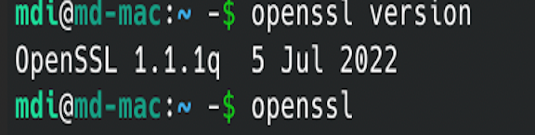

List commands by type
-- list-standard-commands :thisshows all the standard commands in a list. 
-- list-cipher-commands: this shows the cipher commands in a list

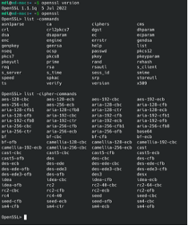

-- list-message-digest-commands this shows the digest commands in a list. These commands are used to generate as well as verify signatures. 
Use the help to find out more about :
OpenSSL >help right here the help commands doesn’t work and says invalid command and hence should use dgst, enc. 
This command is given to find out the further datais. 

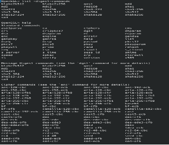

## 2.	Performance of OpenSSL

Make a speed test on your PC-platform with the speed command > speed: this shows the speed test for my laptop platform 

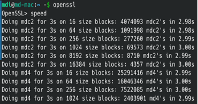

Here, Compare the results for symmetric encryption and RSA signature. Example: >OpenSSL speed rsa1024: this shows the result for the speed test on des-cbc encryption and rsa1024 encryption. 

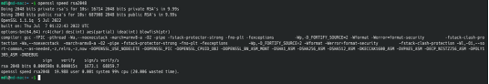

## 3. Using OpenSSL from the command line interface

## a.	Create a text file with some input and encrypt it using : I created a new text file called “msg”  

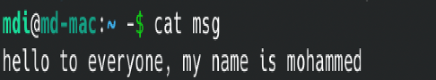

AES-128 CBC: Here I encrypted the msg file by using aes-128 cbc method 

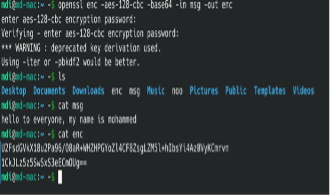

AES-256 CTR: Here I encrypted the “meg” by using AES-256 CTR

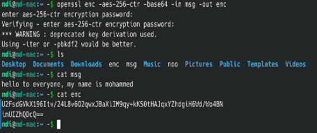

DES: Here I encrypted the messege by DES

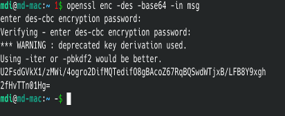

## b.	Create a 2048-bit RSA public and private key: 

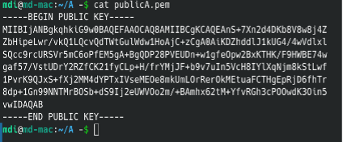

RSA public key: 

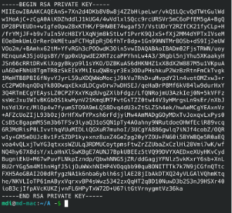

RSA private key: 

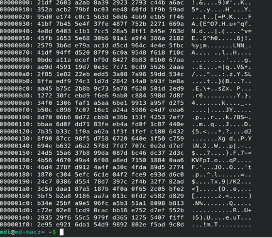

## 4.	 Exchange of encrypted data.

## a.	 Encrypt a file (e.g., a text file) with an algorithm and a key length of your choice.
Here I encrypt a text file, with rsautl and the lenth of 2048bytes. I encrypted the text file using RSA and seved it 
as enc and shown with the command line cat.  Bob will get this file and decrypt the messge.

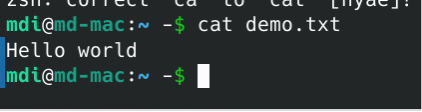

## d.	Decrypt the secret of your neighbor: Here bob will see the messege as he decrypt the cipher text below

